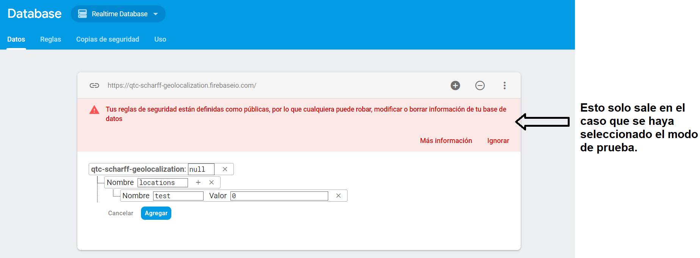

# QTC Scharff Geolocalization

Estos son los pasos a seguir para crear un proyecto en Android usando Firebase, que permita enviar cada cierto tiempo la ubicación del dispositivo que usa el aplicativo móvil.

## Crear proyecto en Firebase

1. Ir a **https://console.firebase.google.com/**

2. Clic en **Agregar proyecto** si es que no se tiene un proyecto, caso contrario seleccionar el proyecto deseado y saltarse al siguiente bloque.


3. En *Nombre del proyecto*, si se tiene un proyecto anterior al que se desea agregar Firebase, se puede seleccionar aquí, caso contrario colocar un nombre para el proyecto nuevo. Como ejemplo se puso *QTC Scharff Geolocalization*.

4. Si se desea, se puede desactivar la configuración predeterminada de Google Analytics, aunque se debe hacer un paso adicional para permitir o denegar qué elementos pueden usar Google Analytics en el proyecto.

5. Clic en **Crear proyecto**.

## Habilitar autenticación y Realtime Database de Firebase

1. Ir a **https://console.firebase.google.com/** y seleccionar el proyecto creado.

2. Seleccionar la pestaña **Authentication**.

3. En la subpestaña **Método de acceso**, seleccionar **Correo electrónico/contraseña**, activarlo haciendo clic en **Habilitar** y **guardar** las configuraciones.


4. Crear los usuarios que se deseen en la subpestaña de **Usuarios**.

5. Seleccionar ahora la pestaña **Database**, ir hacia **Realtime Database** y hacer clic en **Crear base de datos**. De preferencia, dejar la configuración por defecto y hacer clic en **Habilitar**, pues de todas maneras se va a reemplazar la configuración en el paso siguiente.


6. Después de que se haya creado la base de datos, ir a la subpestaña **Reglas** y reemplazar el JSON contenido en dicha pestaña con el JSON a continuación:

``` JSON
{
  "rules": {
    "users": {
      "$uid": {
        ".read": "auth != null",
        ".write": "auth != null && $uid === auth.uid"
      }
    }
  }
}
```
Esto permitirá que cualquier usuario autenticado pueda leer la información del resto de usuarios, pero un usuario autenticado solo puede editar los datos de sí mismo/a.

7. Para evitar que se borre la base de datos al no tener datos colocados, colocar `users` como nodo hijo de la base de datos, y un *nodo de prueba* como nodo hijo de `users`.



## Crear proyecto en Android Studio

Los valores que se usaron fueron:
- **Application Name**: Scharff Geolocalization App
- **Company domain**: qtcteam.com
- **Package name**: com.qtcteam.scharff.geolocalization
- **Minimum SDK**: API 19: Android 4.4 (KitKat)
- **Add an Activity**: *Empty Activity* (nombre de activity *LoginActivity* y nombre de layout *activity_login*)

## Conectar el proyecto móvil con Firebase:

1. En Android Studio, ir a la barra superior, hacer clic en **Tools** y luego en **Firebase**. Se abrirá una pestaña llamada "Asistente" a la derecha.
<div style="text-align: center;"></div>

2. Clic en **Authentication** y luego clic en **Email and password authentication**. Se entrará a la opción de configurar la autenticación con Firebase.
<div style="text-align: center;"></div>

3. Clic en **Connect to Firebase**. Se abrirá una página donde pedirá seleccionar o crear un proyecto de Firebase. Seleccionar el proyecto creado en el paso 1. Hacer clic en **Connect to Firebase**. Esperar a que se sincronice el aplicativo con Firebase.
<div style="text-align: center;"></div>

4. Hacer clic en **Add Firebase Authentication to your app**, aceptar los cambios en `build.gradle` y esperar a que se ejecuten los cambios. Si ocurre algún problema, ir al paso 7 para identificar posibles causas.

5. Regresar al menú principal de Firebase y ahora hacer clic en **Database** y luego clic en **Save and Retrieve Data**. Se entrará a la opción de configurar el uso de Realtime Database de Firebase.
<div style="text-align: center;"></div>

6. Hacer clic en **Add the Realtime Database to your app**, aceptar los cambios en `build.gradle` y esperar a que se ejecuten los cambios. Si ocurre algún problema, ir al siguiente paso para identificar posibles causas.

7. Asegurarse de que en el archivo `build.gradle` de la raíz del proyecto de Android esté colocado lo siguiente:

```JS
buildscript {
    // ...
    dependencies {
        // ...
        classpath 'com.google.gms:google-services:4.2.0'
    }
    // ...
}
```

Y de que en el archivo `build.gradle` del módulo (carpeta) `app` esté colocado lo siguiente, agregando una dependencia para el uso de geolocalización debajo de las de Firebase:

```JS
apply plugin: 'com.android.application'
apply plugin: 'com.google.gms.google-services'

// ...

dependencies {
    // ...
    implementation 'com.google.firebase:firebase-auth:16.2.0'
    implementation 'com.google.firebase:firebase-database:16.1.0'
    implementation 'com.google.android.gms:play-services-location:16.0.0'
    // ...
}
```
Las versiones de Firebase para Android pueden variar conforme pase el tiempo, lo importante es que los módulos estén declarados en los archivos `.gradle`.

## Links de interés

- https://codelabs.developers.google.com/codelabs/realtime-asset-tracking/index.html
- https://www.androidauthority.com/create-a-gps-tracking-application-with-firebase-realtime-databse-844343/
